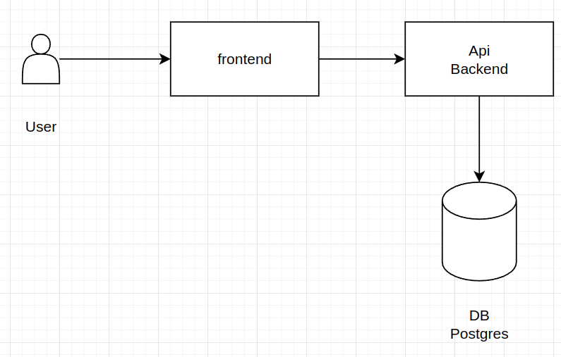

### Documentação

- [React Navigation - Navegação App](https://reactnavigation.org/)
  - [React Reanimated - Drawer](https://docs.swmansion.com/react-native-reanimated/)

### Diagrama conceitual



### Comandos
- Criar app 
```
npx create-expo-app@latest frontend --template https://github.com/expo/expo/tree/main/templates/expo-template-blank
```
- Rodar app
```
npx expo start
```

### Design Patterns
- Variáveis
  - camelCase
  - Exemplo: nomeVariavelExemplo
  - Idioma: inglês
### Utils

- Função formatcurrency(param)
  - Espera receber valores númericos no formato 0000.00
  - Vai formatar para: R$ 0.000,00 
  - Exemplo: 3500.53  - R$ 3.500,53